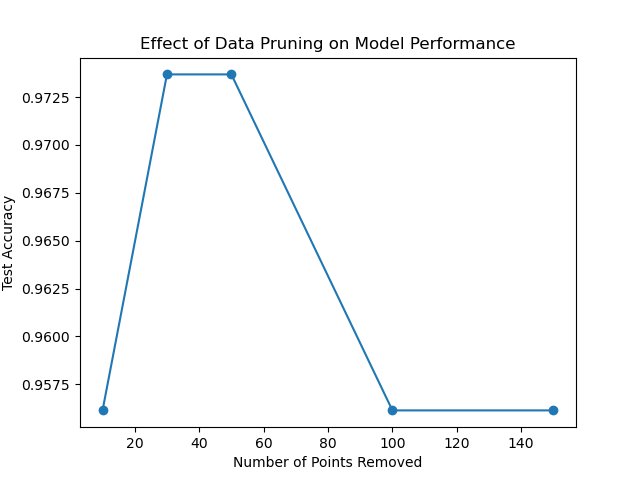
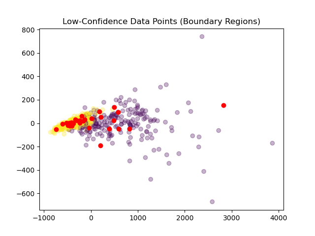

# Data-Centric Geometric Pruning Analysis
A data-centric machine learning project demonstrating how removing low-confidence samples improves model generalization without modifying the model itself.

## Project Journey
This project began with a simple but important question: can improving data quality alone enhance model performance without changing the model architecture?
Instead of focusing on building more complex models, the approach shifted toward understanding how the dataset itself influences performance. During experimentation, it became clear that not all data points contribute equally to learning. Some samples introduce ambiguity and uncertainty, which negatively impacts the model. This led to adopting a data-centric perspective, where improving the dataset becomes the primary objective rather than increasing model complexity.

## Problem Statement
Machine learning models often struggle because of ambiguous or noisy data points, especially those located near decision boundaries. These samples tend to have overlapping characteristics between classes and produce uncertain predictions.
Such data points reduce model confidence, introduce instability during training, and ultimately hurt generalization. The goal of this project is to identify these low-confidence samples and evaluate whether removing them leads to better performance.

## Phase 1: Baseline Model

A Logistic Regression model was trained using a proper train-test split to ensure that performance is evaluated on unseen data.
The model was trained on the complete dataset without any filtering or preprocessing. This provides a reliable baseline for comparison.

**Baseline Accuracy:** 95.61%

This value represents the model’s performance when all data points, including ambiguous ones, are used.

## Phase 2: Confidence Analysis
To identify uncertain samples, prediction probabilities were computed for each data point using the trained model. The confidence of a prediction was defined as the highest probability assigned to any class.
High-confidence predictions indicate that the model is certain about its output, while low-confidence predictions indicate ambiguity. These low-confidence samples are typically located near decision boundaries where the model struggles to clearly separate classes.

## Phase 3: Data Pruning and Experiments
In this phase, low-confidence samples were removed from the training dataset. The idea was to eliminate data points that introduce uncertainty and evaluate how this affects performance.
Multiple pruning levels were tested by removing different numbers of low-confidence samples: 10, 30, 50, 100, and 150. For each configuration, the model was retrained and evaluated on the same test set to ensure consistency.

The results showed that removing a small number of uncertain samples improved accuracy. However, removing too many samples led to a decline in performance, indicating that excessive pruning removes useful information along with noise.

## Phase 4: Geometric Interpretation
Low-confidence samples can be understood geometrically as points lying near decision boundaries in the feature space. These are regions where class overlap occurs and the model finds it difficult to make clear distinctions.

By removing these boundary samples, the decision regions become clearer and more stable, leading to improved classification performance.

## Results Summary
**Baseline Accuracy:** 95.61%  
**Best Accuracy:** 97.37%  
**Improvement:** +1.75%

This shows that a relatively small portion of ambiguous data had a significant impact on the overall performance of the model.

## Key Findings
The experiments demonstrate that moderate pruning improves generalization by removing uncertain samples. However, excessive pruning reduces dataset diversity and leads to performance degradation. This confirms that there exists an optimal level of pruning where the balance between noise removal and information retention is achieved. The results also highlight that confidence scores are an effective way to identify problematic data points.

## Limitations
Confidence is only a proxy for uncertainty and does not represent exact geometric distance from decision boundaries. Some low-confidence samples may still contain useful information, especially in edge cases. Additionally, the effectiveness of this approach may vary depending on the dataset and its distribution.

## Tech Stack
Python, Scikit-learn, NumPy, and Matplotlib were used to implement the model, perform analysis, and generate visualizations.

## Dataset
The project uses the Breast Cancer dataset available within Scikit-learn. This is a built-in dataset, so no external files are required. It is commonly used for classification tasks and ensures that the project remains reproducible and easy to run.

## Conclusion
This project demonstrates that improving data quality through geometric pruning can enhance model performance without modifying the model itself. By removing ambiguous samples near decision boundaries, the model achieves better generalization and more reliable predictions.
The key takeaway is that focusing on data quality can be just as powerful as improving model complexity, and in many cases, a cleaner dataset leads to better results.
